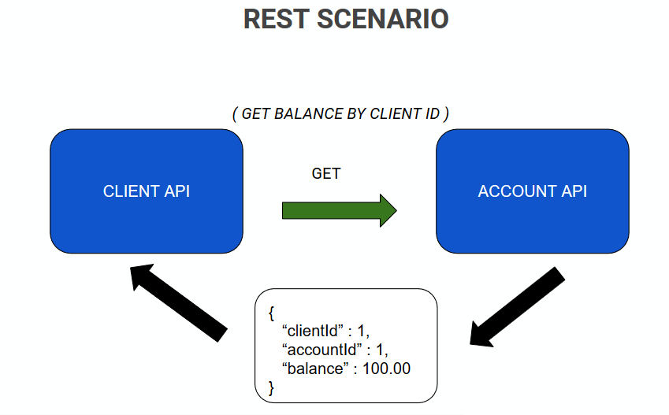

# Pact workshop with Pact JVM and Junit 5

This repository contains examples of implementation of Pact Framework in:
 - Java/Spring Boot;
 - Java/Kafka;
 - Node/Express

## Pact concept

Pact is a code-first tool for testing HTTP and message integrations using contract tests. Contract tests assert that inter-application messages conform to a shared understanding that is documented in a contract. Without contract testing, the only way to ensure that applications will work correctly together is by using expensive and brittle integration tests.
Do you set your house on fire to test your smoke alarm? No, you test the contract it holds with your ears by using the testing button. Pact provides that testing button for your code, allowing you to safely confirm that your applications will work together without having to deploy the world first.

## Scenario

I maked two rest apis called client API and Account API. The client API must call account API to get client balance. This apis have an dependence, that is an simple example to use pact framework to make Consumer Driven Contract Test

## Pact Workflow

The consumer creates and maintains a contract. Both the consumer and provider verify against that contract with every change in their code base.

The process of consumer-driven contracts looks like this:

 - The API consumer creates and maintains a contract (in agreement with the provider).

 - The API consumer verifies that it successfully runs against the contract.

 - The API consumer publishes the contract.

 - The API provider verifies that it successfully runs against the contract.

## Examples

The "integration" folder only have an integration between apis. If you want see full example, please jump to the "example" folder. 
The example folder has [Java examples](https://github.com/martetech/dtp-pact/tree/master/example/java) and [Node example](https://github.com/martetech/dtp-pact/tree/master/example/node/one_consumer_one_producer).

## Links

 - Documentation:  
https://docs.pact.io/

- PactFlow:  
https://pactflow.io/

 - Pact Benefits:  
https://pactflow.io/how-pact-works/?utm_source=ossdocs&utm_campaign=intro_animation#slide-1

- Pact Broker:  
https://github.com/pact-foundation/pact_broker

