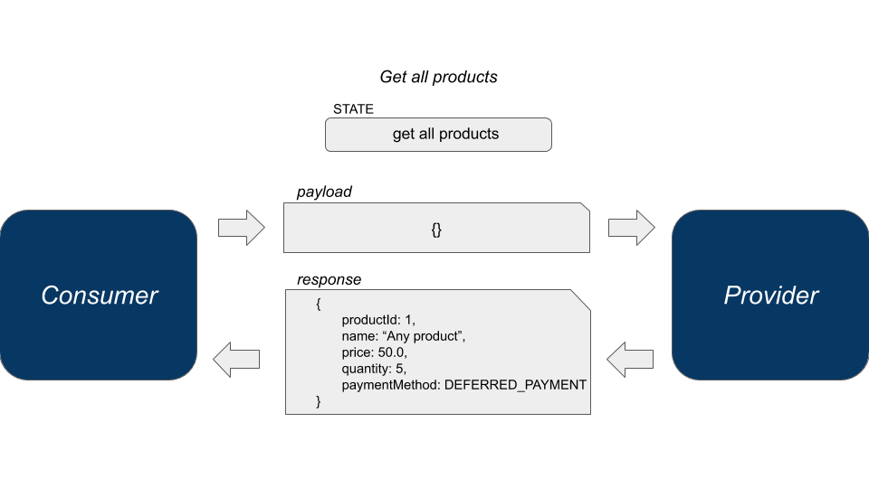
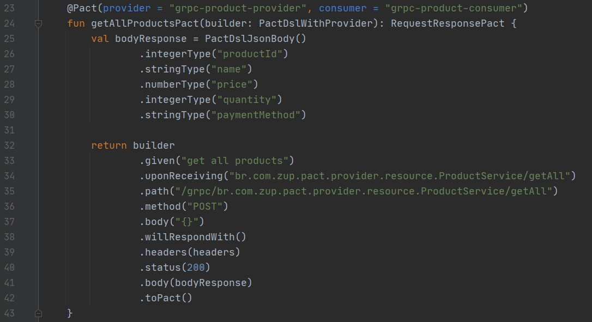
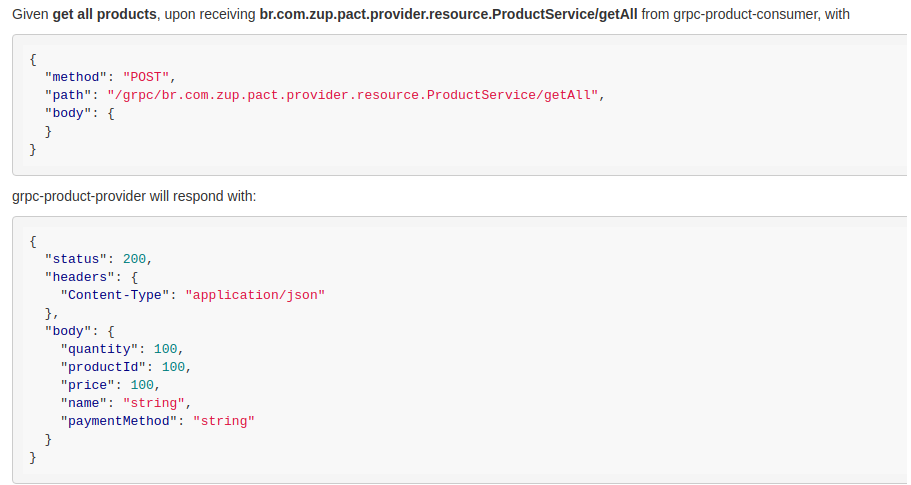
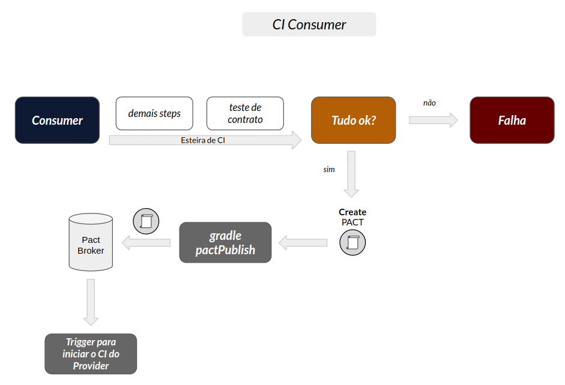
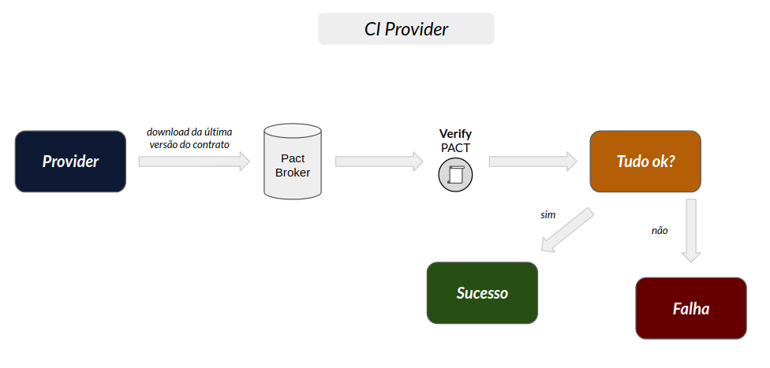
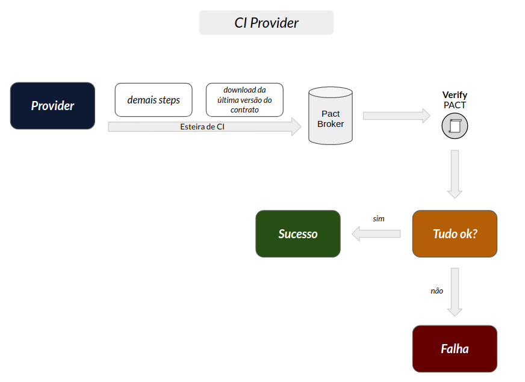

# Exemplo de Integração Contínua com GitlabCI

Neste exemplo, temos uma implementação do Pact com Micronaut + GRPC + Pact + GitlabCI

- 1 consumidor (consumer)
- 1 provedor (provider)

## Ferramentas

- GitlabCI
- Postgresql
- Pact Broker
- Kotlin
- Micronaut
- Gradle

## Índice

<!--ts-->

- [O que é o PACT?](#O-que-é-o-PACT?)
- [Por que usar o PACT?](#Por-que-usar-o-PACT?)
- [Cenário de exemplo desta POC gRPC](#Cenário-de-exemplo-desta-POC-gRPC)
- [Mas se o gRPC já é uma espécie de contrato, porque preciso do PACT?](#Mas-se-o-gRPC-já-é-uma-espécie-de-contrato-porque-preciso-do-PACT?)
- [Como o PACT pode ajudar a evitar essas falhas?](#Como-o-PACT-pode-ajudar-a-evitar-essas-falhas?)
- [GitlabCI](#GitlabCI)
- [Como executar](#Como-executar)
<!--ts -->

## O que é o PACT?

O [PACT](https://docs.pact.io/) é um framework que [implementa o conceito de CDC](https://www.zup.com.br/blog/testes-de-contratos-com-pact-2-consumer-driven-contract) em forma de testes unitários BDD (Behavior Driven Development). Quando escritos, os testes são executados simulando a integração que deverá ser executada — gerando o contrato, validando sua assinatura e garantindo a integração — sem a necessidade de subir projetos em algum ambiente integrado.<br>
Mais informações podem ser obtidas no guia [How PACT works](https://pactflow.io/how-pact-works/?utm_source=ossdocs&utm_campaign=intro_animation#slide-1).

## Por que usar o PACT?

Abaixo elencamos algumas das vantagens em se utilizar o teste de contrato para garantir a qualidade das integrações entre sistemas.

<!--ts-->

- Os testes de contrato economizam tempo de desenvolvimento ao:
  - Fornecer feedback rápido aos desenvolvedores e QA's do time;
  - Permitem que as falhas de teste sejam depuradas localmente na máquina do
    desenvoldedor.
- Economia de recursos:
  - Reduzem ou eliminam o número de testes de integração que necessitam de ambiente
    homologação;
  - Os testes de contrato geralmente são executados em tempo de desenvolvimento e/ou durante a esteira de entrega (CI e CD) tornando possível a identificação de bugs nos contratos antes mesmo deles serem publicados em quaisquer ambientes, seja QA, Homologação ou Produção, evitando o retrabalho.
  <!--ts -->

## Cenário de exemplo desta POC gRPC

Este exemplo aborda um cenário comum no setor de atacado/varejo.
Nosso objetivo é obter todos os produtos disponíveis no serviço provedor.
Para isto, vamos considerar que este dado será recuperado da seguinte forma:

1 - Solicitamos ao serviço de dominio do cliente (consumer) a lista de produtos disponíveis,
algo como um carrinho de compras que solicita a relação produtos em um serviço externo. <br>
2 - Por sua vez, o consumer pergunta ao serviço de domínio dos produtos (provider) quais os
produtos disponíveis e suas respectivas informações (preço, quantidade, método de pagamento etc). <br>
3 - De posse da relação de produtos o consumer as envia a quem solicitou.

De forma resumida, temos os seguintes serviços:

- provider: mantém e gerencia informações relacionadas a produtos.
- consumer: solicita produtos ao provider atuando como um carrinho de compras.

A imagem abaixo representa esta interação que acabamos de definir:



## Mas se o gRPC já é uma espécie de contrato, porque preciso do PACT?

Como em muitos sistemas RPC, o gRPC é baseado na ideia de definir um serviço, especificando os métodos que podem ser chamados remotamente com seus parâmetros e tipos de retorno. No lado do servidor, o servidor implementa esse contrato (interface) e executa um servidor gRPC para lidar com as chamadas do cliente. Entretanto, devemos observar [pontos](https://docs.microsoft.com/pt-br/aspnet/core/grpc/versioning?view=aspnetcore-5.0) que podem levar a quebra de integrações, por exemplo:

- **Redefinir tipo de atributo** - ao alterar o tipo de um atributo, por exemplo, de `int32` para `double` no arquivo .proto, o provedor do serviço continuará funcionando, porém se o consumidor não receber essa alteração, haverá quebra na comunicação, esse tipo de alteração é identificado pelo PACT realizando o teste de contrato preventivamente.

- **Renomear um pacote, serviço ou método** - o gRPC usa o nome do pacote, o nome do serviço e o nome do método para criar a URL, caso algum desses itens sejam modificados sem a devida comunicação aos consumidores do serviço, haverá uma quebra de integração, esse tipo de alteração também é identificado pelo PACT realizando o teste de contrato preventivamente.

- **Removendo um serviço ou método** - haverá quebra de integração pois o cliente tentará acessar um recurso inexistente, esse tipo de alteração também é identificado pelo PACT realizando o teste de contrato preventivamente.

## Como o PACT pode ajudar a evitar essas falhas?

Quando o cliente(consumer) de uma aplicação gera um contrato com suas expectativas, dentre as informações ele pode definir o nome dos campos, seu tipo (linhas 26 à 38) e a url (ou path) com o pacote, nome do serviço e o método que deseja acessar (linhas 34 e 35) conforme imagem abaixo.


<br><br>

O contrato gerado fica registrado no [Pact Broker](https://docs.pact.io/pact_broker) onde o provedor(provider) do serviço pode baixá-lo para realizar as asserções. O contrato dentro do broker possui o seguinte formato:


<br><br>

Como podemos ver no recorte de contrato acima, ele trás consigo um exemplo fidedigno de tudo que o consumidor da aplicação espera que o provedor forneça, desta forma durante uma esteira de CI/CD o provedor conseguirá verificar se está totalmente de acordo com as expectativas do consumidor. O PACT garante uma **amarração** entre consumer e provider **sem a necessidade** de manter de pé ambientes com alto consumo de recursos (dev, homologação) e sem os riscos de tais ambientes ou seus mocks estarem **desatualizados** o que geraria sinais falsos de sucesso nos testes.

## GitlabCI

Para tirarmos maior proveito do teste de contrato com o Pact, devemos automatizar suas verificações com ferramentas de CI, dando assim maior velocidade de verificação dos nossos contratos.

Um fluxo de CI de teste de contrato segue os seguintes passos:

Quando o Consumer inicia o CI:

- Consumer realiza demais steps do CI.
- Ao chegar nos testes de contrato, é executado o teste unitário do Pact no projeto Consumer, caso o teste tenha sido executado com sucesso, o arquivo contrato do Pact é gerado na pasta target do projeto.
- No próximo passo utilizamos o gradle para enviar esse contrato para o Broker do Pact com o comando gradle pactPublish.
- Será enviado um comando trigger para inicializar o CI do provider da integração.


<br><br>

- O CI do Provider continuará o processo, rodando a classe de teste unitário do Pact implementada no Provider.
- Essa classe, baixará o contrato do Broker, executará o teste subindo seu endpoint e executando o teste baseando se na expectativa que o consumer descreveu nos testes.
- Caso o teste seja efetuado com sucesso, significa que o contrato é válido entre as integrações, o CI retornará OK e temos nossa garantia nessa integração.


<br><br>

Quando o Provider inicia o CI:

- Provider realiza demais steps do CI.
- Ao chegar nos testes de contrato, o Provider executará a classe de testes de contrato que baixará a ultima versão de contrato publicada no Broker. Se essa versão condizer com o endpoint que o provider está fornecendo, o teste passará, se houve alguma alteração inesperada pelo lado do consumer, o teste falhará e o CI falhará, indicando que há algo errado na integração.


<br><br>

## Como executar

Toda Stack desse exemplo foi testado apenas em ambiente linux.

1. Suba os containers que estão no arquivo docker-compose.yml

```
sudo docker-compose up
```

Para que consigamos executar os pipelines localmente precisamos criar Runners do Gitlab, neste exemplo incluí dois Runners que são Runners Docker, eles são responsáveis por rodar os Pipelines do GitlabCI.

2. Com todos containers executando, execute o script (construct-pact-gitlab.sh)

```
sudo chmod +x construct-pact-gitlab.sh
./construct-pact-gitlab.sh
```

Neste passo, serão linkados os Runners no GitlabCI, será criado um token para chamadas API no Gitlab e serão criados todos os requisitos dos dois repositórios para que seja executada a pipeline. Também serão clonados os repos criados e copiados os dois projetos exemplo para esses repos e enviados para o container Gitlab que quando receber os arquivos executará a pipeline.

## Troubleshooting

- Ao executar o comando `sudo docker-compose up` pela primeira vez, você pode se deparar com o seguinte erro do Docker `ERROR: Pool overlaps with other one on this address space`, caso isso aconteça, execute o comando `docker network prune` e tente novamente.
