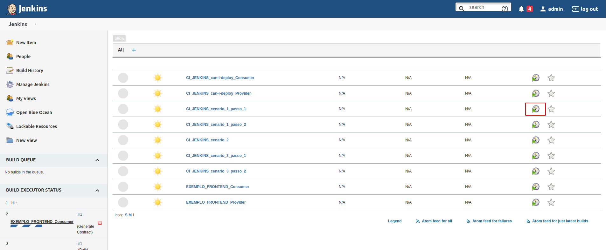

# Exemplo de Integração Contínua com Jenkins

Exemplo da criação de um Pact entre:
* 1 consumidor ([pact-consumer-sample](https://github.com/vinirib/pact-consumer-sample))
* 1 provedor ([pact-provider-sample](https://github.com/vinirib/pact-provider-sample))

## Ferramentas

 - Jenkins
 - Postgresql
 - Pact Broker


Índice
=================

<!--ts-->
   * [Caracteristicas deste exemplo](#Caracteristicas-deste-exemplo)
   * [Cenários contidos neste exemplo](#Cenários-contidos-neste-exemplo)
      * [Primeiro cenário](#Primeiro-cenário)
      * [Segundo cenário](#Segundo-cenário)
      * [Terceiro cenário](#Terceiro-cenário)
   * [Configurações do Jenkins](#Configurações-do-Jenkins)
   * [Observações](#Observações)
<!--ts -->

## Caracteristicas deste exemplo

Os cenários contidos neste exemplo seguem basicamente três passos:

1 - O docker-compose irá criar uma instância do Jenkins e do Pact Broker. 
Ao iniciar, o Jenkins irá baixar as APIs de seus respectivos repositórios em branch master. Em seguida, irá rodar um arquivo jenkins customizado para projetos maven e gerar os contratos do nosso consumidor(`pact-consumer-sample`). Em seguida, os contratos são enviados ao Pact Broker.

2 - Se tivermos sucesso na etapa anterior, o próximo Job será disparado, fazendo o download do repositório do provedor (`pact-provider-sample`) e rodando os testes JUnit. Estes testes validarão o contrato entre o consumidor e provedor.

3 - Tendo sucesso nas duas etapas anteriores, Jenkins irá disparar o último Job utilizando uma ferramenta chamada `can-i-deploy`, que é nada mais que um utilitário do Pact que fará a verificação da integração. Se tiver acontecido como esperado, você poderá ver todos os jobs com resultado OK no Jenkins.

## Cenários contidos neste exemplo

Este exemplo contém três cenários. Neles, descreveremos as interações mais comuns em que você pode combinar o Pact Broker e Jenkins com seus testes de contrato.

### Primeiro cenário 
diretório: cenario_1

Este cenário representa o fluxo básico. O consumidor cria um código para testar a integração com seu provedor e gerar o contrato com o Pact Framework. No entanto, neste caso temos também alguns arquivos Jenkins no repositório do consumidor para disparar eventos da integração contínua. Desta forma, conseguimos rodar os testes JUnit, gerar o contrato e fazer sua publicação no Pact Broker de forma automatizada.

Obtendo sucesso até aqui, em seguida será disparado o próximo Job, que irá rodar os teste JUnit no lado do provedor e verificar a validade do contrato.

Por fim, o último Job será disparado para executar o `can-i-deploy` e, então, verificar se o resultado foi de sucesso e/ou de falha.


### Segundo cenário
diretório: cenario_2

No segundo cenário, o provedor realizou alterações no enpoint que o consumidor utiliza (sem aviso prévio). Assim, quando o CI for disparado, 
o Pact entre eles irá resultar em falha.


### Terceiro cenário
diretório: cenario_3

No terceiro cenário, o consumidor fez algumas melhorias e disparou o CI para verificar alterações na integração. Porém, para nossa surpresa, o provedor fez novas alterações que irão implicar na falha de integridade do contrato.


## Configurações do Jenkins

> As configurações do Jenkins são específicas para cada cenário. Siga as instruções abaixo para cada um destes cenários.
> Entre um cenário e outro, remova os containers criados executando: `sudo docker-compose down`.

No diretório do cenário, jenkins_config, arquivo jobs.groovy, temos alguns jobs configurados para nosso teste. Estes Jobs devem executar nossos testes de forma automatizada. 

Para da inicio a automação, basta rodar o comando:
```
sudo docker-compose up
```

Com o containers rodando, poderemos ver o dashboad do Jenkins ([http://localhost:8080](http://localhost:8080)) com os Jobs CI pré-configurados e interconectados. 



Para acesso ao Jenkins:
```bash
user:admin
pass:admin
```

> Caso tenha alguma dificuldade para subir o container `jenkins_pact_broker`, verifique se o diretório `jenkins_home` possui permissões de escrita. 
> Caso não tenha permissão, podemos conceder da seguinte forma:
```
sudo chown $USER:$USER jenkins_home -R
```

## Observações

No JenkinsFile, quando o consumidor e o provedor validam seus contratos, é uma boa prática versionar as APIs com um hashcode.
No nosso caso utilizamos a hash do git commit, além de tags, para visualizarmos versões mais recentes facilmente. Esta prática também pode ser encontrada na [documentação do pact](https://docs.pact.io/getting_started/versioning_in_the_pact_broker).
