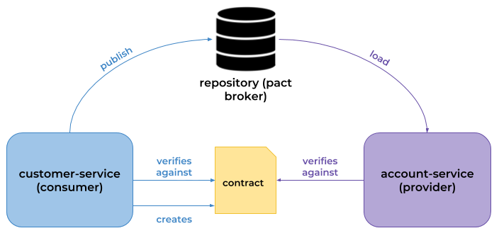

# PACT CONSUMER SAMPLE

This repository contains an example of implementation 
of Pact Framework in Spring Boot and Junit 5.

## Tools Used

 - OpenJdk 11
 - Spring Boot
 - Swagger
 - Pact JVM
 - Pact Broker

## Pact concept

Pact is a code-first tool for testing HTTP and message integrations using contract tests. Contract tests assert that inter-application messages conform to a shared understanding that is documented in a contract. Without contract testing, the only way to ensure that applications will work correctly together is by using expensive and brittle integration tests.
Do you set your house on fire to test your smoke alarm? No, you test the contract it holds with your ears by using the testing button. Pact provides that testing button for your code, allowing you to safely confirm that your applications will work together without having to deploy the world first.

## Pact Workflow

The consumer creates and maintains a contract. Both the consumer and provider verify against that contract with every change in their code base.

The process of consumer-driven contracts looks like this:

 - The API consumer creates and maintains a contract (in agreement with the provider).

 - The API consumer verifies that it successfully runs against the contract.

 - The API consumer publishes the contract.

 - The API provider verifies that it successfully runs against the contract.

## How to use

To make all pact CI flow, clone pact-ci-workshop

https://github.com/vinirib/pact-ci-workshop