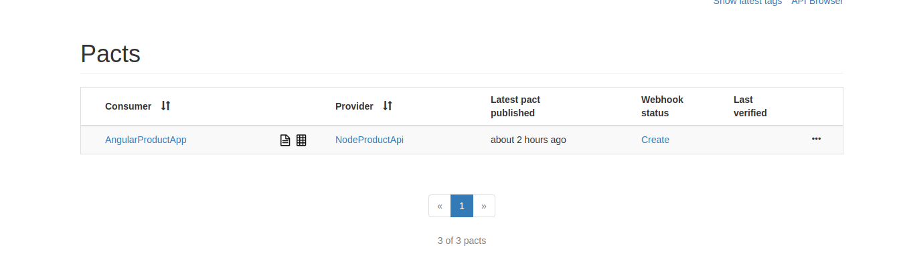
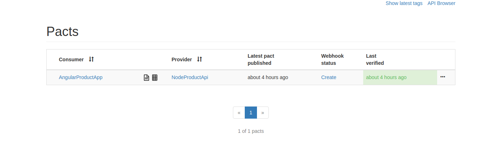
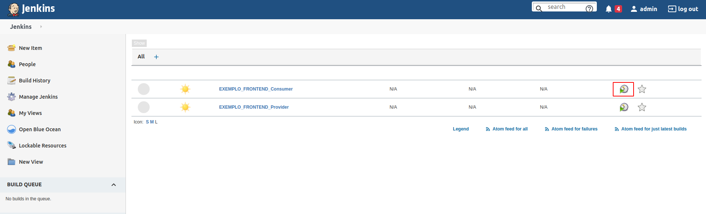

# Exemplo de aplicação Frontend Angular

Exemplo da criação de um Pact entre:

- 1 consumidor Angular (Consumer)
- 1 provedor Node (Provider)

## Ferramentas

- Node + npm
- Angular CLI
- Express
- Typescript
- Jest
- Pact
- Pact Broker
- Jenkins

## Cenários

Este exemplo aborda um cenário comum em muitos estabelecimentos.
Nosso objetivo é ter todo o gerenciamento de produtos como visualização, cadastro, edição e exclusão, através de uma interface.
Vamos considerar que a interface é responsável somente pelas chamadas, todo o gerenciamento real dos produtos acontece no serviço `provider`, portanto, vamos aos cenários.

### Criação de um produto

1 - Para criarmos um novo produto, preenchemos os campos necessários na interface e clicamos no botão `Save`.

2 - O front-end irá disparar uma requisição do tipo POST para o serviço `provider`, enviando os dados que foram preenchidos no passo anterior.

3 - O `provider` por sua vez, irá realizar o cadastro desse novo produto e retorná-lo para o front-end.
<br>

A imagem abaixo representa este fluxo:


As demais requisições (visualização, edição e exclusão) seguem um fluxo similar ao apresentado.

De forma resumida, temos os seguintes serviços:

- consumer: front-end responsável pela interface e por fazer a conexão com o provider.
- provider: mantém e gerencia informações sobre os produtos.

## Como rodar os projetos localmente

1. Primeiramente, pelo terminal, entre no diretório `provider` e execute o comando `npm install` para instalar as dependências do projeto.

2. Agora vamos executar o projeto com o seguinte comando `npm run dev:server`. Você deverá ver no log do terminal a mensagem confirmando que o projeto está rodando: `Provider listening on port 3333`.

3. Abra outra aba do terminal e navegue até o diretório `consumer`, vamos instalar as dependências (`npm install`) desse projeto também.

4. Execute o comando `npm run start` para executar a aplicação front-end. Após esse comando, você verá logs de compilação e logo após uma outra mensagem `** Angular Live Development Server is listening on localhost:4200, open your browser on http://localhost:4200/ **`.

Conforme nos foi informado, se abrirmos o navegador no endereço `http://localhost:4200`, veremos a seguinte tela:


A partir dessa interface podemos testar as funcionalidades da aplicação, como o cadastro, edição e remoção.

### Executando os testes manualmente

1. Garanta que você tenha uma instância do Pact Broker rodando localmente.
   Vide sessão [configuração do Pact Broker](../../../README.md#config-broker) caso tenha dúvida.

2. Com o Broker funcionando, podemos iniciar os testes.
   Primeiro, precisamos instalar as dependencias da API. Para isto, va até o diretório `consumer` e execute o seguinte comando:

```shell
npm install
```

Em seguida, precisamos gerar o contrato do PACT para a nossa API consumidora e o publicamos no Broker. <br>
No mesmo diretório, execute os seguintes comandos:

```shell
npm run test
```

```shell
npm run pact:publish
```

Acesse o Pact Broker [`http://localhost:9292`](http://localhost:9292) em seu navegador. Você deverá ver o contrato publicado.



Caso tenha interesse, o contrato gerado pode ser conferido no diretório `consumer/pacts`.

3. Para validar o contrato gerado, vamos até o diretório da nossa API provedora (provider) `provider`.
   Novamente, precisamos instalar as dependencias da API. Para isto, execute o seguinte comando:

```shell
npm install
```

Para testarmos o contrato com a API consumidora, precisamos apenas rodar o teste da API.
Para isto, execute:

```shell
npm run test
```

Este teste irá verificar no Broker os contratos disponiveis para validação, baixá-los e testá-los de acordo com a API.
Ao final, podemos conferir o resultado do teste que é publicado no Broker.



### Executando os testes em CI via Jenkins

1. Garanta que você tenha uma instância do Pact Broker com Jenkins rodando localmente.
   Vide sessão [configuração do Pact Broker](../../../README.md#config-broker) caso tenha dúvida.

Com o containers rodando, poderemos ver o dashboad do Jenkins com os Jobs pré-configurados.



2. Os pipelines estão nomeados de acordo com sua função, cenário e etapa.
   Para iniciar a esteira, basta clicar no ícone de agendamento (destacado em vermelho na imagem acima) do pipeline `EXEMPLO_FRONTEND_Consumer`.
   Após finalizar o pipeline, você poderá verificar o pact publicado no broker.

3. Para iniciar a esteira do provider, basta clica no ícone de agendamento do pipeline `EXEMPLO_FRONTEND_Provider`.
   Ao final, podemos verificar o contrato no Pact Broker.
