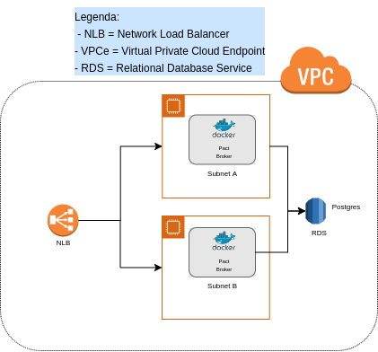

# Exemplo de Pact Broker no AWS usando IaC

Se você precisar de uma instalação básica de um PACT broker no AWS balanceado por um NLB (Network Load Balance) segue aqui um exemplo provisionamento utilizando Terraform.

## Infraestrutura

Seguem os componentes do AWS que são provisionados:



- 1 x Network Load Balancer (NLB)
- 2 x EC2 com Amazon Linux 2
- 1 x RDS Postgres


## Setup

- terraform >= 0.13.0 
- aws-cli >= 2.0.38
- Python >= 3.7.3
- Ubuntu >= 18.04

1. Você vai precisar ter o AWS cli configurado e autenticado em sua máquina para que o terraform consiga se conectar na sua conta do AWS utilizando sua autenticação. Para mais detalhes de como configurar, seguir o <a href="https://docs.aws.amazon.com/pt_br/cli/latest/userguide/cli-configure-files.html">link</a> 
2. Você precisa já ter uma VPC criada e subnets associadas a ela.
2. Você vai precisar criar um certificado auto-assinado no formato pem para que suas VMs no EC2 estejam protegidas por SSL. Caso tenha dúvida seguir esse passo a passo <a href="https://www.ibm.com/support/knowledgecenter/SSMNED_5.0.0/com.ibm.apic.cmc.doc/task_apionprem_gernerate_self_signed_openSSL.html">aqui</a>

## Como executar

1. Iniciar o terraform no diretório de trabalho:

```
terraform init
```
2. Criar plano de execução dos recursos que sero provisionados no AWS:
```
TF_VAR_aws_key_name=<cert-name> TF_VAR_aws_key_path=<cert-path> terraform plan
```
cert-path -> path onde o certificado se encontra<br>
cert-name -> nome da chave/certificado

3. Aplicar as alterações informadas no output do plano de execuçaõ:
```
TF_VAR_aws_key_name=<cert-name> TF_VAR_aws_key_path=<cert-path> terraform apply
```
Observação: Você vai precisar alterar o arquivo <a href="./broker-variables.tf">broker-variables.tf</a> para setar o seu VPC id e os nomes das subnets disponíveis para criar os seus revcursos nas variáveis ```vpc_id``` e ```aws_subnet_by_names``` 


## Troubleshooting

- Caso tente executar o comando ```terraform plan``` e receba o erro abaixo, provavelmente você o seu AWS cli não est autenticado corretamente.
   ```Error: error configuring Terraform AWS Provider: no valid credential sources for Terraform AWS Provider found.```
- Caso precise colocar o terraform em modo DEBUG basta setar a variável de ambiente para DEBUG, caso queira volta é somente voltar para INFO: 
```
 export TF_LOG=DEBUG
```
