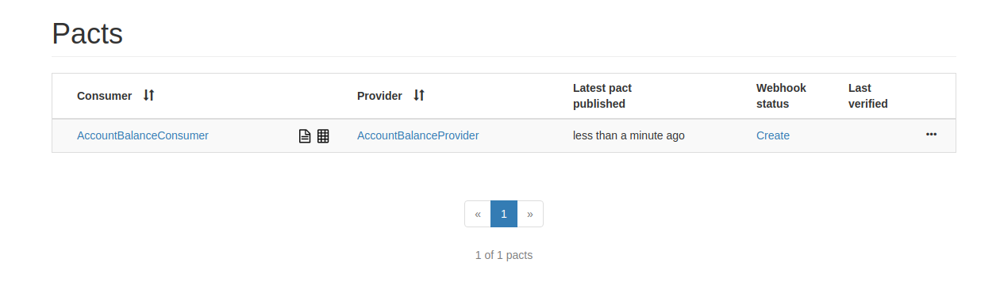

# Exemplo em Java Spring Boot

Exemplo da criação de um Pact entre:
* 1 consumidor (Consumer)
* 1 provedor (Provider)

- Veja este mesmo cenário feito em [Node](../../../node/one_consumer_one_provider).

## Ferramentas

 - OpenJdk 11
 - Spring Boot
 - Swagger
 - Lombok
 - Pact JVM
 - Pact Broker
 
## Como executar

1. Garanta que você tenha uma instância do Pact Broker rodando localmente. 
Para maiores informações, vide sessão [configuração do Pact Broker](../../../../README.md#config-broker).

2. Abra os projetos contido neste diretório (`consumer` e `provider`) em sua IDE de preferência e 
instale suas dependências. Se estiver usando o IntelliJ, você também precisará instalar o [Plugin do Lombok](https://projectlombok.org/setup/intellij).

3. Para gerar o contrato, basta rodar os testes Junit do projeto `consumer`. <br>
Obtendo sucesso, o plugin maven do Pact irá gerar um arquivo json contendo o contrato entre as APIs.
Veja os exemplos nas imagens abaixo.


4. Com o contrato gerado, podemos publicá-lo no Pact Broker. 
Para isto, podemos utilizar o plugin maven do Pact. <br>
É necessário confirmar que o plugin está configurado corretamente.


Após confirmar o status do plugin, abra outro terminal no diretório `consumer` e execute o seguinte comando para publicar o contrato no Broker:

```
mvn pact:publish
```

Em seguida, você poderá ver o contrato publicado no Pact Broker [http://localhost:9292](http://localhost:9292).



5. Com o contrato publicado no Broker, agora validaremos se a API provedora (provider) 
está aderente ao contrato.

No projeto `provider`, rode os testes Junit e verifique se eles são concluídos com sucesso. <br>
Este teste irá verificar no Broker os contratos disponiveis para validação, baixá-los e testá-los de acordo com a API provedora. <br>

> Para este passo, configuramos para que a publição do resultado seja feita automaticamente assim que a validação do contrato ocorre. <br>
> Veja a configuração em: [AccountProviderPactTest.java](./provider/src/test/java/br/com/zup/pact/provider/pact/AccountProviderPactTest.java) linha 41 <br>
```
System.setProperty("pact.verifier.publishResults", "true");
```

Para verificar o resultado, basta acessar novamente o Broker. 


