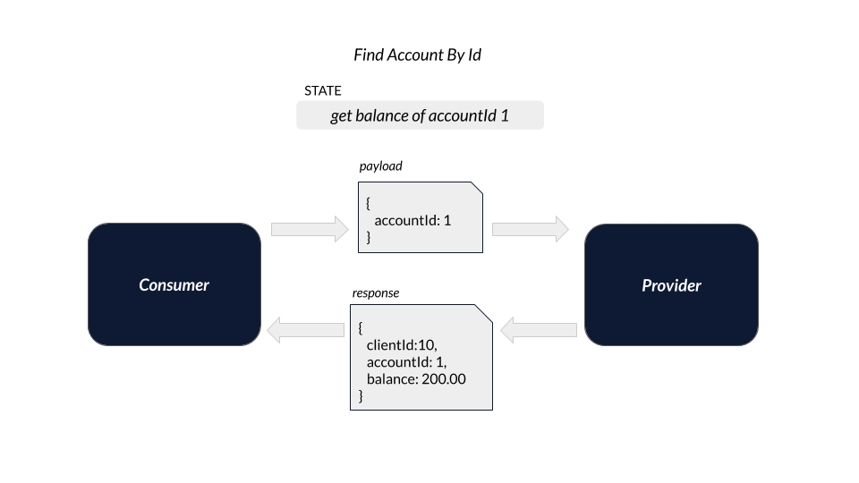
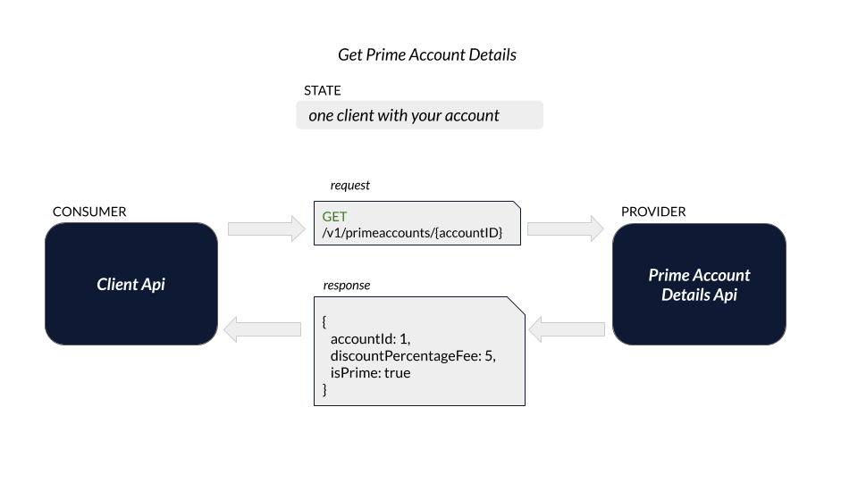
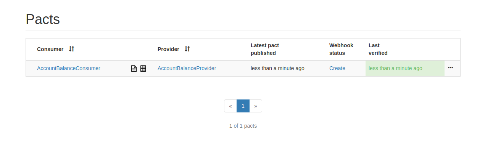

# Exemplo em Java Spring Boot

Exemplo da criação de um Pact entre:
* 1 consumidor (Consumer)
* 2 provedor (Provider)

- Veja este mesmo cenário feito em [Node](../../../node/one_consumer_two_providers).

## Ferramentas

 - OpenJdk 11
 - Spring Boot
 - Swagger
 - Lombok
 - Pact JVM
 - Pact Broker
 - Maven

 ## Índice

<!--ts-->

- [Cenários](#Cenários)
  - [Obtendo saldo](#Obtendo-saldo)
  - [Obtendo a porcentagem de desconto](#Obtendo-a-porcentagem-de-desconto)
- [Como executar](#Como-executar)
<!--ts -->

## Cenários

Este exemplo aborda um cenário comum no setor bancário.
Nosso objetivo é obter o dado de saldo de determinado cliente e/ou obter o dado da porcentagem de desconto de determinada conta.
Para isto, vamos considerar que este dado será recuperado da seguinte forma:

### Obtendo saldo

1 - Com o identificador do cliente, solicitamos ao serviço de dominio do cliente (client-api) o valor do saldo em conta. <br>
2 - Por sua vez, o client-api pergunta ao serviço de domínio da conta (account-api) qual o saldo contido na conta atrelada aquele cliente. <br>
3 - Tendo a informação do saldo em conta, o client-api retorna a informação a quem a solicitou.

A imagem abaixo representa este fluxo.



### Obtendo a porcentagem de desconto

1 - Com o identificador do cliente, solicitamos ao serviço de dominio do cliente (client-api) a porcentagem de desconto. <br>
2 - Por sua vez, o client-api pergunta ao serviço de domínio da conta (prime-account-details-api) qual a porcentagem de desconto que aquele cliente tem direito. <br>
3 - Tendo a informação da porcentagem de desconto, o client-api retorna a informação a quem a solicitou.

A imagem abaixo representa este fluxo.



De forma resumida, temos os seguintes serviços:

- account-api: mantém e gerencia informações relacionadas a contas bancárias.
- prime-account-details-api: mantém e gerencia informações relacionadas a porcentagem de desconto das contas.
- client-api: mantém e gerencia informações sobre clientes/correntistas.
 
## Como executar

1. Garanta que você tenha uma instância do Pact Broker rodando localmente. 
Vide sessão [configuração do Pact Broker](../../../../README.md#config-broker) caso tenha dúvida.

2. Abra os projetos contido neste diretório (`consumer`, `prime-account-details-provider` e `account-provider`) em sua IDE de preferência e 
instale suas dependências. Se estiver usando o IntelliJ, você também precisará instalar o [Plugin do Lombok](https://projectlombok.org/setup/intellij).

3. Para gerar o contrato, basta rodar os testes Junit do projeto `consumer`. <br>
Obtendo sucesso, o plugin maven do Pact irá gerar um arquivo json contendo o contrato entre as APIs.
Veja os exemplos nas imagens abaixo.


4. Com o contrato gerado, podemos publicá-lo no Pact Broker. 
Para isto, podemos utilizar o [plugin maven do Pact](https://mvnrepository.com/artifact/au.com.dius/pact-jvm-provider). <br>
É necessário confirmar que o plugin está configurado corretamente.


Após confirmar o status do plugin, abra outro terminal no diretório `consumer` e execute o seguinte comando:

```
mvn pact:publish
```

Em seguida, você poderá ver o contrato publicado no Pact Broker ```http://localhost:9292```.

5. Com o contrato publicado no Broker, agora validaremos se a API provedora (provider) 
está aderente ao contrato.

No projeto `account-provider`, rode os testes Junit e verifique se eles são concluídos com sucesso. <br>
Este teste irá verificar no Broker os contratos disponiveis para validação, baixá-los e testá-los de acordo com a API provedora. <br>

> Para este passo, configuramos para que a publição do resultado seja feita automaticamente assim que a validação do contrato ocorre. <br>
> Veja a configuração em: [AccountProviderPactTest.java](./account-provider/src/test/java/br/com/zup/pact/accountprovider/pact/AccountProviderPactTest.java) linha 41 <br>
```
System.setProperty("pact.verifier.publishResults", "true");
```
Para verificar o resultado, basta acessar novamente o Broker. 



6. Para validar o contrato do segunda API provedora, bas segui o mesmo processo do item anterior, mas desta vez com o projeto `prime-account-details-provider`
