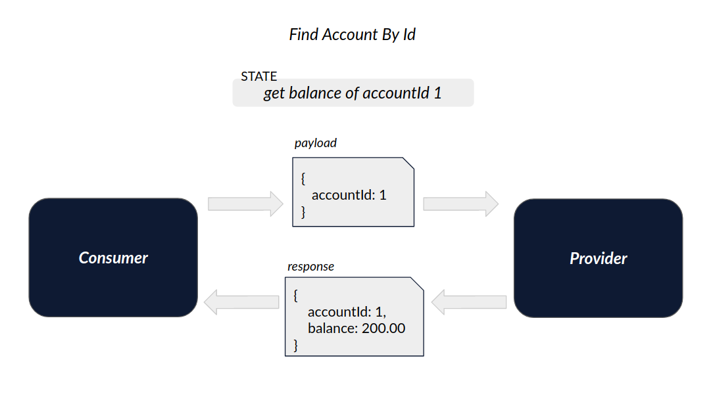
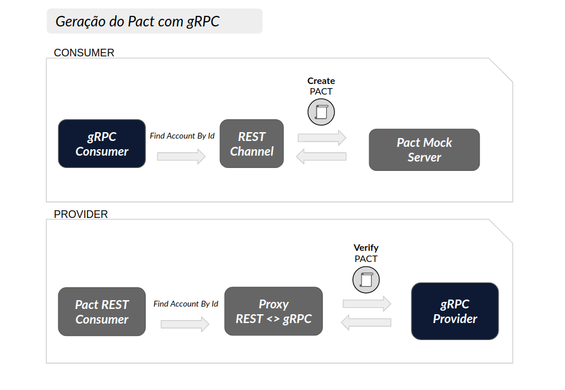
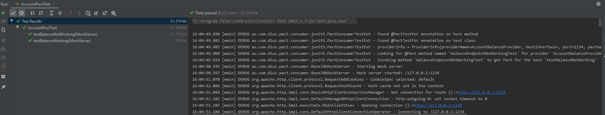
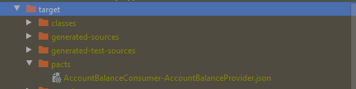
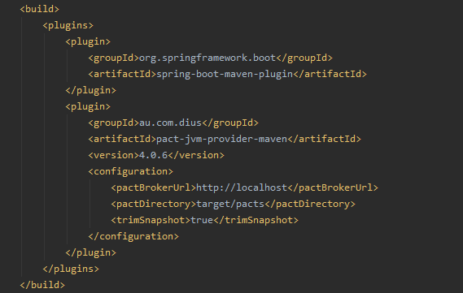
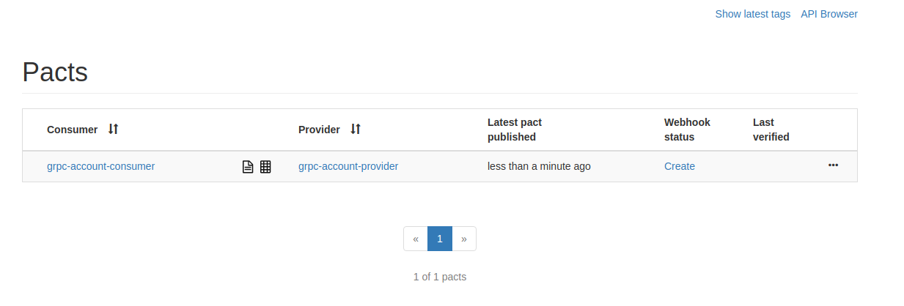
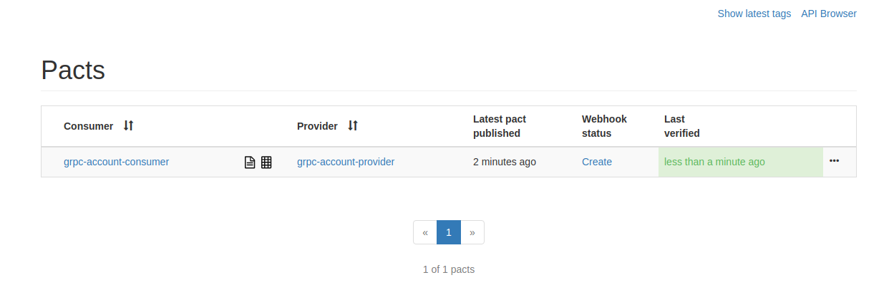

# Exemplo em Kotlin com gRPC

Exemplo da criação de um Pact entre:
* 1 consumidor (Consumer)
* 1 provedor (Provider)

- Veja este mesmo cenário feito em [Node](../../node/gRPC).

## Ferramentas

 - Kotlin
 - OpenJdk 11
 - Spring Boot
 - Grpc Spring Boot Starter
 - Pact JVM
 - Pact Broker
 - [Mockk](https://mockk.io/)
 - [AssertJ](https://joel-costigliola.github.io/assertj/)

## Índice

<!--ts-->

- [Cenário](#Cenário)
- [Compatibilidade com gRPC](#Compatibilidade-com-gRPC)
  - [Solução no lado do Consumidor](#Solução-no-lado-do-Consumidor)
  - [Solução no lado do Provedor](#Solução-no-lado-do-Provedor)
- [Mas se o gRPC já é uma espécie de contrato, porque preciso do PACT?](#Mas-se-o-gRPC-já-é-uma-espécie-de-contrato-porque-preciso-do-PACT?)
- [Como executar](#Como-executar)

<!--ts -->


## Cenário

Este exemplo aborda um cenário comum no setor bancário.
Nosso objetivo é obter o dado de saldo de determinado cliente. 
Para isto, vamos considerar que este dado será recuperado da seguinte forma:

1 - Com o identificador do cliente, solicitamos ao serviço de dominio do cliente (consumer) o valor do saldo em conta. <br>
2 - Por sua vez, o consumer pergunta ao serviço de domínio da conta (provider) qual o saldo contido na conta atrelada aquele cliente. <br>
3 - Tendo a informação do saldo em conta, o consumer retorna a informação a quem a solicitou.

De forma resumida, temos os seguintes serviços:

* provider: mantém e gerencia informações relacionadas a contas bancárias.
* consumer: mantém e gerencia informações sobre clientes/correntistas.

A imagem abaixo representa esta interação que acabamos de definir.




## Compatibilidade com gRPC

Atualmente, o Pact suporta cenários de integração via REST, Mensageria e GraphQL. 
No entanto, como podemos ver no [roadmap do framework](https://pact.canny.io/feature-requests/p/support-protobufs), o suporte oficial para gRPC já está planejado.
Enquanto esperamos este novo recurso, preparamos uma solução para que você possa iniciar seus testes desde já,
de forma que seja fácil migrar para uma solução definitiva no futuro. 

Como dizemos acima, hoje o Pact não tem suporte para protocolo gRPC, mas e se conseguissemos 
transformar, ou representar, esta chamada em outro protocolo que o Pact entenda (ex: REST) ? 
É exatamente esta a abordagem adotada aqui. 

* ### Solução no lado do Consumidor

Toda a comunicação feita entre um consumer e um provider gRPC é realizada através da criação de um **Channel**.
Logo, se conseguimos extender esta classe Channel e alterar seu comportamento, podemos ditar como a comunicação 
irá ocorrer. Extendendo o channel e sobrescrevendo o método *newCall*, conseguimos alterar seu comportamente para ( apenas em ambiente de teste ) realizar requisições REST no lugar de requisições gRPC. É assim que conseguimos obter informações destas chamadas gRPC, incluindo dados definidos no protofile como **package**, **service** e **method**, para então montarmos uma chamada REST, seguindo a seguinte convenção:

```
POST http://{{address}}/grpc/{{packagaName}}.{{service}}/{{method}}
``` 
* ex: POST http://provider/grpc/br.com.zup.pact.provider.resource.AccountResource/findById


Tendo gerado então esta chamada REST, conseguimos seguir o fluxo de teste do Pact no lado do consumidor.

Para maiores detalhes sobre a implementação dos testes, vide o arquivo de teste [FindProductContractTest.kt](./consumer/src/test/kotlin/br/com/zup/pact/consumer/pact/FindProductContractTest.kt). 

* ### Solução no lado do Provedor

De forma análoga a solução proposta no lado do Consumidor, no lado do Provedor precisamos fazer a tradução entre a chamada gRPC e REST, mas de forma inversa (REST > gRPC). 
Para isto, precisamos criar um servidor REST como *proxy* (apenas em ambiente de teste), que escute as chamadas que definimos no lado do consumidor e as encaminhe para o servidor gRPC. 
Neste caso utilizamos *Spring Boot Web* para implementarmos este *proxy* seguindo a convenção definida anteriormente.
Para maiores detalhes sobre a implementação dos testes, vide o arquivo de teste em [provider/src/tests/verify-pact.spec.ts](./consumer/src/tests/verify-pact.spec.ts). 

A imagem a seguir representa esta solução:


 
## Mas se o gRPC já é uma espécie de contrato, porque preciso do PACT?

Como em muitos sistemas RPC, o gRPC é baseado na ideia de definir um serviço, especificando os métodos que podem ser chamados remotamente com seus parâmetros e tipos de retorno. No lado do servidor, o servidor implementa esse contrato (interface) e executa um servidor gRPC para lidar com as chamadas do cliente. Entretanto, devemos observar [pontos](https://docs.microsoft.com/pt-br/aspnet/core/grpc/versioning?view=aspnetcore-5.0) que podem levar a quebra de integrações, por exemplo:

- **Redefinir tipo de atributo** - ao alterar o tipo de um atributo, por exemplo, de `int32` para `double` no arquivo .proto, o provedor do serviço continuará funcionando, porém se o consumidor não receber essa alteração, haverá quebra na comunicação, esse tipo de alteração é identificado pelo PACT realizando o teste de contrato preventivamente.

- **Renomear um pacote, serviço ou método** - o gRPC usa o nome do pacote, o nome do serviço e o nome do método para criar a URL, caso algum desses itens sejam modificados sem a devida comunicação aos consumidores do serviço, haverá uma quebra de integração, esse tipo de alteração também é identificado pelo PACT realizando o teste de contrato preventivamente.

- **Removendo um serviço ou método** - haverá quebra de integração pois o cliente tentará acessar um recurso inexistente, esse tipo de alteração também é identificado pelo PACT realizando o teste de contrato preventivamente.


## Como executar

1. Garanta que você tenha uma instância do Pact Broker rodando localmente. 
Para maiores informações, vide sessão [configuração do Pact Broker](../../../README.md#config-broker).

2. Abra os projetos contido neste diretório (`consumer` e `provider`) em sua IDE de preferência e 
instale suas dependências. para garantir que os assets gRPC foram gerados corretamente, 
rode o seguinte comando na raiz de cada projeto:

```
mvn clean install -DskipTests
```

3. Para gerar o contrato, basta rodar os testes Junit do projeto `consumer`. <br>
Obtendo sucesso, o plugin maven do Pact irá gerar um arquivo json contendo o contrato entre as APIs.
Veja os exemplos nas imagens abaixo.





4. Com o contrato gerado, podemos publicá-lo no Pact Broker. 
Para isto, podemos utilizar o plugin maven do Pact. <br>
É necessário confirmar que o plugin está configurado corretamente.



Após confirmar o status do plugin, abra outro terminal no diretório `consumer` e execute o seguinte comando para publicar o contrato no Broker:

```
mvn pact:publish
```

Em seguida, você poderá ver o contrato publicado no Pact Broker [http://localhost:9292](http://localhost:9292).



5. Com o contrato publicado no Broker, agora validaremos se a API provedora (provider) 
está aderente ao contrato.

No projeto `provider`, rode os testes Junit e verifique se eles são concluídos com sucesso. <br>
Este teste irá verificar no Broker os contratos disponiveis para validação, baixá-los e testá-los de acordo com a API provedora. <br>

> Para este passo, configuramos para que a publição do resultado seja feita automaticamente assim que a validação do contrato ocorre. <br>
> Veja a configuração em: [AccountProviderPactTest.java](./provider/src/test/java/br/com/zup/pact/provider/pact/AccountProviderPactTest.java) linha 41 <br>
```
System.setProperty("pact.verifier.publishResults", "true");
```

Para verificar o resultado, basta acessar novamente o Broker. 


