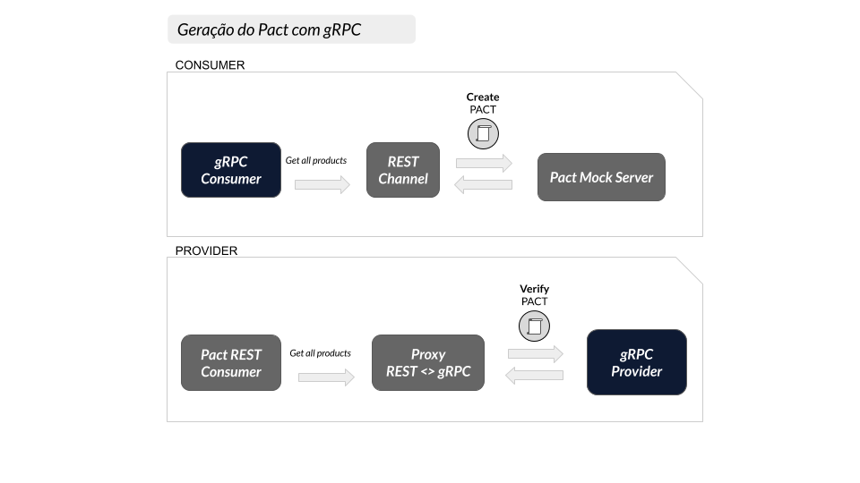
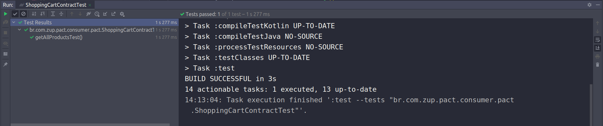
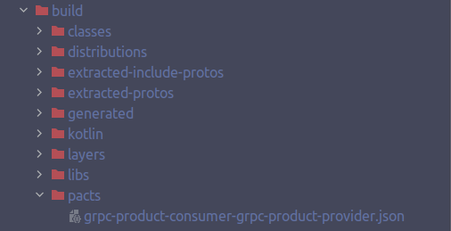
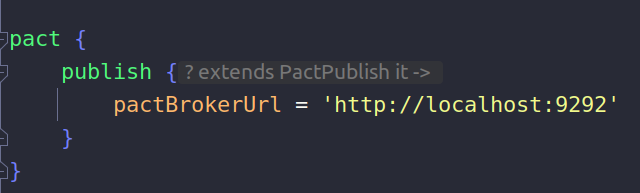
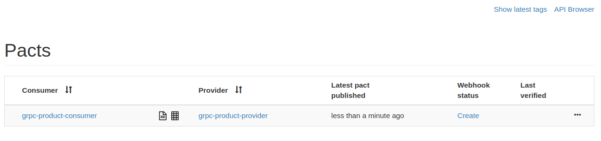
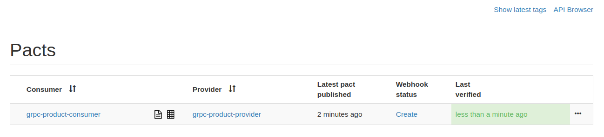

# Exemplo em Kotlin com gRPC

Exemplo da criação de um Pact entre:
* 1 consumidor (Consumer)
* 1 provedor (Provider)

- Veja este mesmo cenário feito em [Node](../../node/gRPC).

## Ferramentas

 - Kotlin - 1.4.10
 - OpenJdk 11
 - Micronaut - 2.1.2
 - Gradle - 6.7
 - Pact JVM
 - Pact Broker
 - [Mockk](https://mockk.io/)
 - [AssertJ](https://joel-costigliola.github.io/assertj/)

## Cenário

Este exemplo aborda um cenário comum no setor de atacado/varejo.
Nosso objetivo é obter todos os produtos disponíveis no serviço provedor.
Para isto, vamos considerar que este dado será recuperado da seguinte forma:

1 - Solicitamos ao serviço de dominio do cliente (consumer) a lista de produtos disponíveis, 
algo como um carrinho de compras que solicita a relação produtos em um serviço externo. <br>
2 - Por sua vez, o consumer pergunta ao serviço de domínio dos produtos (provider) quais os 
produtos disponíveis e suas respectivas informações (preço, quantidade, método de pagamento etc). <br>
3 - De posse da relação de produtos o consumer as envia a quem solicitou.

De forma resumida, temos os seguintes serviços:

* provider: mantém e gerencia informações relacionadas a produtos.
* consumer: solicita produtos ao provider atuando como um carrinho de compras.

A imagem abaixo representa esta interação que acabamos de definir:


## Compatibilidade com gRPC

Atualmente, o Pact suporta cenários de integração via REST, Mensageria e GraphQL. 
No entanto, como podemos ver no [roadmap do framework](https://pact.canny.io/feature-requests/p/support-protobufs), o suporte oficial para gRPC já está planejado.
Enquanto esperamos este novo recurso, preparamos uma solução para que você possa iniciar seus testes desde já, de forma que seja fácil migrar para uma solução definitiva no futuro. 

Como dizemos acima, hoje o Pact não tem suporte para protocolo gRPC, mas e se conseguissemos 
transformar, ou representar, esta chamada em outro protocolo que o Pact entenda (ex: REST)? 
É exatamente esta a abordagem adotada aqui. 

* ### Solução no lado do Consumidor

Toda a comunicação feita entre um consumer e um provider gRPC é realizada através da criação de um **Channel**.
Logo, se conseguimos extender esta classe Channel e alterar seu comportamento, podemos ditar como a comunicação 
irá ocorrer. Extendendo o channel e sobrescrevendo o método *newCall*, conseguimos alterar seu comportamente para ( apenas em ambiente de teste ) realizar requisições REST no lugar de requisições gRPC. É assim que conseguimos obter informações destas chamadas gRPC, incluindo dados definidos no protofile como **package**, **service** e **method**, para então montarmos uma chamada REST, seguindo a seguinte convenção:

```
POST http://{{address}}/grpc/{{packageName}}.{{service}}/{{method}}
``` 
* ex: POST http://provider/grpc/br.com.zup.pact.provider.resource.ProductService/getAll


Tendo gerado então esta chamada REST, conseguimos seguir o fluxo de teste do Pact no lado do consumidor.

Para maiores detalhes sobre a implementação dos testes, vide o arquivo de teste [ShoppingCartContractTest.kt](./consumer/src/test/kotlin/br/com/zup/pact/consumer/pact/ShoppingCartContractTest.kt). 

* ### Solução no lado do Provedor

De forma análoga a solução proposta no lado do Consumidor, no lado do Provedor precisamos fazer a tradução entre a chamada gRPC e REST, mas de forma inversa (REST > gRPC). 
Para isto, precisamos criar um servidor REST como *proxy* (apenas em ambiente de teste), que escute as chamadas que definimos no lado do consumidor e as encaminhe para o servidor gRPC. 
Neste caso utilizamos *Micronaut Http Server* para implementarmos este *proxy* seguindo a convenção definida anteriormente.
Para maiores detalhes sobre a implementação dos testes, vide o arquivo de teste em [ShoppingCartProviderPactTest.kt](./provider/src/test/kotlin/br/com/zup/pact/provider/pact/ShoppingCartProviderPactTest.kt). 

A imagem a seguir representa esta solução:


 
## Como executar

1. Garanta que você tenha uma instância do Pact Broker rodando localmente. 
Para maiores informações, vide seção [configuração do Pact Broker](../../../README.md#config-broker).

2. Abra os projetos contidos neste diretório (`consumer` e `provider`) em sua IDE de preferência e 
instale suas dependências. Para garantir que os assets gRPC foram gerados corretamente, 
rode o seguinte comando na raiz de cada projeto:

```
gradle build
```

3. Para gerar o contrato, basta rodar os testes Junit da classe 
`ShoppingCartContractTest` no projeto `consumer`. <br>
Obtendo sucesso, o plugin Gradle do Pact irá gerar um arquivo json contendo o contrato entre as APIs.
Veja os exemplos nas imagens abaixo.





4. Com o contrato gerado, podemos publicá-lo no Pact Broker. 
Para isto, podemos utilizar o plugin Gradle do Pact. <br>
É necessário confirmar que o plugin está configurado corretamente dentro do arquivo 
`build.gradle`:



Após confirmar o status do plugin, abra outro terminal no diretório `consumer` e execute o seguinte comando para publicar o contrato no Broker:

```
gradle pactPublish
```

Em seguida, você poderá ver o contrato publicado no Pact Broker [http://localhost:9292](http://localhost:9292).



5. Com o contrato publicado no Broker, agora validaremos se a API provedora (provider) 
está aderente ao contrato.

No projeto `provider`, rode os testes da classe [ShoppingCartProviderPactTest.kt](./provider/src/test/kotlin/br/com/zup/pact/provider/pact/ShoppingCartProviderPactTest.kt) e verifique se eles são concluídos com sucesso. <br>

Este teste irá verificar no Broker os contratos disponiveis para validação, baixá-los e testá-los de acordo com a API provedora. <br>

> Para este passo, configuramos para que a publição do resultado seja feita automaticamente assim que a validação do contrato ocorre. <br>

Para verificar o resultado, basta acessar novamente o Broker. 


