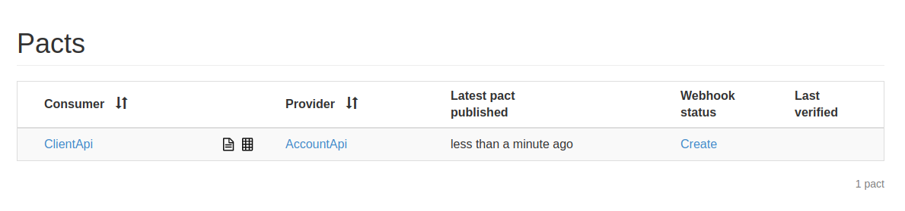

# Exemplo em Node

Exemplo da criação de um Pact entre:
* 1 consumidor (Consumer)
* 1 provedor (Provider)

- Veja este mesmo cenário feito em [Java](../../java/spring-boot/one_consumer_one_provider).

## Ferramentas

- Express
- Typescript
- Jest
- Pact
- Pact Broker

## Como executar

1. Garanta que você tenha uma instância do Pact Broker rodando localmente. 
Vide sessão [configuração do Pact Broker](../../../README.md#config-broker) caso tenha dúvida.


2. Com o Broker funcionando, podemos iniciar os testes.
Primeiro, precisamos instalar as dependencias da API. Para isto, va até o diretório `client-api` e execute o seguinte comando:

```shell
npm install
```
Em seguida, precisamos gerar o contrato do PACT para a nossa API consumidora e o publicamos no Broker. <br>
No mesmo diretório, execute os seguintes comandos:

```shell
yarn test
```

```shell
yarn pact:publish
```

Acesse o Pact Broker (`http://localhost:9292`) em seu navegador. Você deverá ver o contrato publicado.



Caso tenha interesse, o contrato gerado pode ser conferido no diretório `client-api/pacts`.


3. Para validar o contrato gerado, vamos até o diretório da nossa API provedora (provider) `account-api`.
Novamente, precisamos instalar as dependencias da API. Para isto, execute o seguinte comando:

```shell
npm install
```

Para testarmos o contrato com a API consumidora, precisamos apenas rodar o teste da API.
Para isto, execute:

```shell
yarn test
```

Este teste irá verificar no Broker os contratos disponiveis para validação, baixá-los e testá-los de acordo com a API.
Ao final, podemos conferir o resultado do teste que é publicado no Broker. 


**Ao final, entre com CTRL + C para liberar o terminal**
