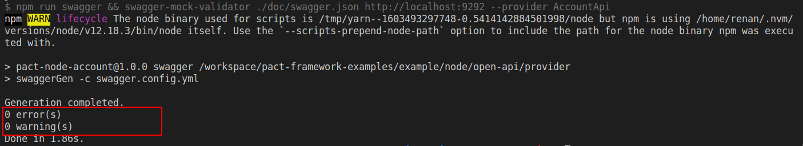

> Este é um trabalho em progresso [WIP]

# Exemplo em Node gRPC

Exemplo da criação de um Pact entre:

- 1 consumidor (account-api)
- 1 provedor (client-api)

## Ferramentas

- Node + npm
- Express
- [Typescript Rest](https://www.npmjs.com/package/typescript-rest)
- [Swagger Mock Validator](https://www.npmjs.com/package/swagger-mock-validator)
- Pact
- Pact Broker
- Jest


## Cenário

Este exemplo aborda um cenário comum no setor bancário.
Nosso objetivo é obter o dado de saldo de determinado cliente. 
Para isto, vamos considerar que este dado será recuperado da seguinte forma:

1 - Com o identificador do cliente, solicitamos ao serviço de dominio do cliente (client-api) o valor do saldo em conta. <br>
2 - Por sua vez, o client-api pergunta ao serviço de domínio da conta (account-api) qual o saldo contido na conta atrelada aquele cliente. <br>
3 - Tendo a informação do saldo em conta, o client-api retorna a informação a quem a solicitou.

De forma resumida, temos os seguintes serviços:

* account-api: mantém e gerencia informações relacionadas a contas bancárias.
* client-api: mantém e gerencia informações sobre clientes/correntistas.

A imagem abaixo representa esta interação que acabamos de definir.


## Integração com OpenAPI

O contrato do cenário abordado neste exemplo é testado utilizando a biblioteca [Swagger Mock Validator](https://www.npmjs.com/package/swagger-mock-validator). Esta biblioteca funciona da seguinte forma:

1 - O consumidor gera seu contrato PACT como de costume e o publica no Pact Broker. <br>
2 - O provedor, por sua vez, gera sua documentação OpenAPI. Neste caso utilizamos o [Swagger V3+](https://swagger.io/specification/) que segue a especificação OpenAPI.<br>
3 - Utilizamos o cli do ```swagger-mock-validator``` para validar o contrato PACT contra a especificação OpenAPI. 

> **NOTA**: Atualmente, o resultado desta validação não é publicado no PACT Broker, o que quebra o ciclo de feedback do PACT.<br>
> Estamos trabalhando em uma melhoria que preenche esta lacuna. Em breve atualizaremos este exemplo com mais detalhes sobre esta abordagem.

## Como executar

Aqui, temos o passo a passo para conseguirmos averiguar o cenário acima.

1. Garanta que você tenha uma instância do Pact Broker rodando localmente.
   Vide sessão [configuração do Pact Broker](../../../README.md#config-broker) caso tenha dúvida.

2. Com o Broker funcionando, podemos iniciar os testes.
   Primeiro, precisamos instalar as dependencias da API. Para isto, va até o diretório `client-api` e execute o seguinte comando:

```shell
npm install
```

Em seguida, precisamos gerar o contrato do PACT para a nossa API consumidora e o publicamos no Broker. <br>
No mesmo diretório, execute os seguintes comandos:

```shell
npm run test
```

```shell
npm run pact:publish
```

Acesse o Pact Broker (`http://localhost:9292`) em seu navegador. Você deverá ver o contrato publicado.


Caso tenha interesse, o contrato gerado pode ser conferido no diretório `client-api/pacts`.

3. Para validar o contrato gerado, vamos até o diretório da nossa API provedora (provider) `account-api`.
   Novamente, precisamos instalar as dependencias da API. Para isto, execute o seguinte comando:

```shell
npm install
```

Para testarmos o contrato com a API consumidora, precisamos apenas rodar o seguinte comando:

```shell
npm run pact:verify
```

Este teste irá verificar no Broker os contratos disponiveis para validação, baixá-los e testá-los de acordo com a especificação OpenAPI do Provedor.
Ao final, podemos conferir o resultado no terminal:

