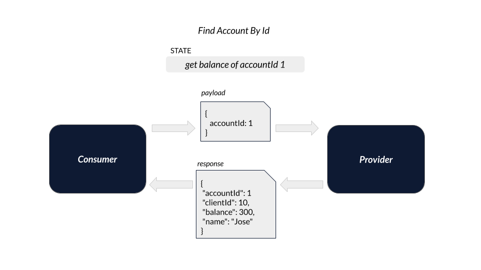
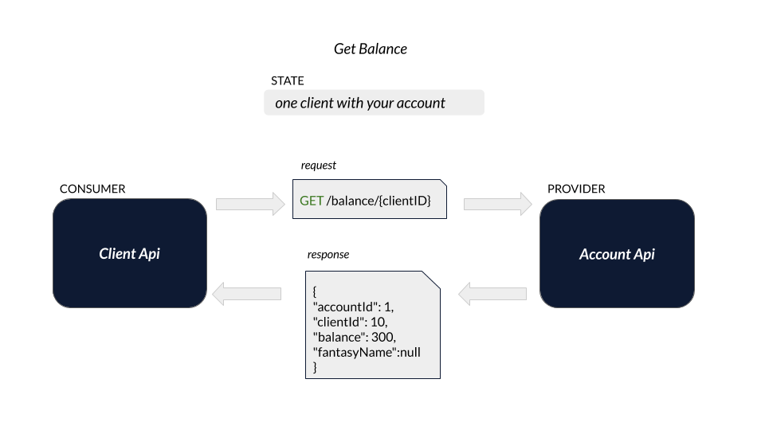

# Exemplo em Java Spring Boot

Exemplo da criação de um Pact entre:
* 2 consumidores (Consumers)
* 1 provedor (Provider)

- Veja este mesmo cenário feito em [Node](../../../node/two_consumers_one_provider).

## Ferramentas

 - OpenJdk 11
 - Spring Boot
 - Swagger
 - Lombok
 - Pact JVM
 - Pact Broker
 - Maven

## Índice

<!--ts-->

- [Cenários](#Cenários)
  - [Obtendo o saldo a partir do cliente pessoa física](#Obtendo-o-saldo-a-partir-do-cliente-pessoa-física)
  - [Obtendo o saldo a partir do cliente pessoa jurídica](#Obtendo-o-saldo-a-partir-do-cliente-pessoa-jurídica)
- [Como executar](#Como-executar)
<!--ts -->

## Cenários

Neste exemplo, abordamos um cenário típico de uma API (`provider`) que provê dados de saldo de determinado cliente.
No entanto, o cliente (consumer) pode ser uma pessoa comum (`common-person`) ou uma pessoa jurídica (`legal-person`).

Além da informação de saldo, a pessoa comum espera receber da API provedora um atributo dizendo qual seu identificador e seu nome.

Da mesma forma, a pessoa jurídica espera receber, além da informação de saldo, qual seu identificador e, neste caso, seu nome fantasia registrado junto ao CNPJ.

No passo seguinte, iremos conferir a criação dos contratos para ambos clientes, comum e jurídico, e como a API de saldo atendo os dois casos.

### Obtendo o saldo a partir do cliente pessoa física

1 - Com o identificador do cliente, solicitamos ao serviço de dominio do cliente (common-person-client) o valor do saldo em conta. <br>
2 - Por sua vez, o common-person-client pergunta ao serviço de domínio da conta (account-api) qual o saldo contido na conta atrelada aquele cliente. <br>
3 - Tendo a informação do saldo em conta, o common-person-client retorna a informação a quem a solicitou.

A imagem abaixo representa esse fluxo.



### Obtendo o saldo a partir do cliente pessoa jurídica

1 - Com o identificador do cliente, solicitamos ao serviço de dominio do cliente (legal-person-client) o valor do saldo em conta. <br>
2 - Por sua vez, o legal-person-client-client pergunta ao serviço de domínio da conta (account-api) qual o saldo contido na conta atrelada aquele cliente. <br>
3 - Tendo a informação do saldo em conta, o common-person-client retorna a informação a quem a solicitou.

A imagem abaixo representa esse fluxo.



De forma resumida, temos os seguintes serviços:

- account-api: mantém e gerencia informações relacionadas a contas bancárias.
- legal-person-client: mantém e gerencia informações sobre clientes pessoa jurídica.
- common-person-client: mantém e gerencia informações sobre clientes pessoa física.

## Como executar

1. Garanta que você tenha uma instância do Pact Broker rodando localmente. 
Vide sessão [configuração do Pact Broker](../../../../README.md#config-broker) caso tenha dúvida.

2. Abra os projetos contido neste diretório (`legal-person-consumer`, `common-person-consumer` e `provider`) em sua IDE de preferência e 
instale suas dependências. Se estiver usando o IntelliJ, você também precisará instalar o [Plugin do Lombok](https://projectlombok.org/setup/intellij).

3. Para gerar o contrato da primeira API consumidora, basta rodar os testes Junit do projeto `legal-person-consumer`. <br>
Obtendo sucesso, o plugin maven do Pact irá gerar um arquivo json contendo o contrato entre as APIs.
Veja os exemplos nas imagens abaixo.


4. Com o contrato gerado, podemos publicá-lo no Pact Broker. 
Para isto, podemos utilizar o [plugin maven do Pact](https://mvnrepository.com/artifact/au.com.dius/pact-jvm-provider). <br>
É necessário confirmar que o plugin está configurado corretamente.


Após confirmar o status do plugin, abra outro terminal no diretório `common-person-consumer` e execute o seguinte comando:

```
mvn pact:publish
```

Em seguida, você poderá ver o contrato publicado no Pact Broker ```http://localhost:9292```.

5. Para gerar o contrato da segunda API consumidora, basta seguir novamente os passos 4 e 5, mas desta vez com o projeto `common-person-consumer`.

6. Com o contrato publicado no Broker, agora validaremos se a API provedora (provider) 
está aderente ao contrato.

No projeto `provider`, rode os testes Junit e verifique se eles são concluídos com sucesso. <br>
Este teste irá verificar no Broker os contratos disponiveis para validação, baixá-los e testá-los de acordo com a API provedora. <br>

> Para este passo, configuramos para que a publição do resultado seja feita automaticamente assim que a validação do contrato ocorre. <br>
> Veja a configuração em: [AccountProviderPactTest.java](./provider/src/test/java/br/com/zup/pact/provider/pact/AccountProviderPactTest.java) linha 41 <br>
```
System.setProperty("pact.verifier.publishResults", "true");
```

Para verificar o resultado, basta acessar novamente o Broker. 


