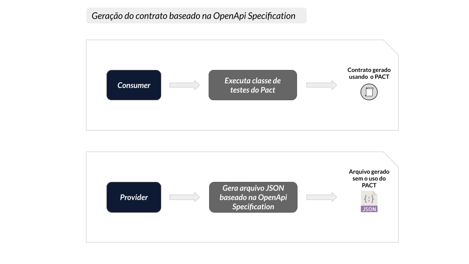
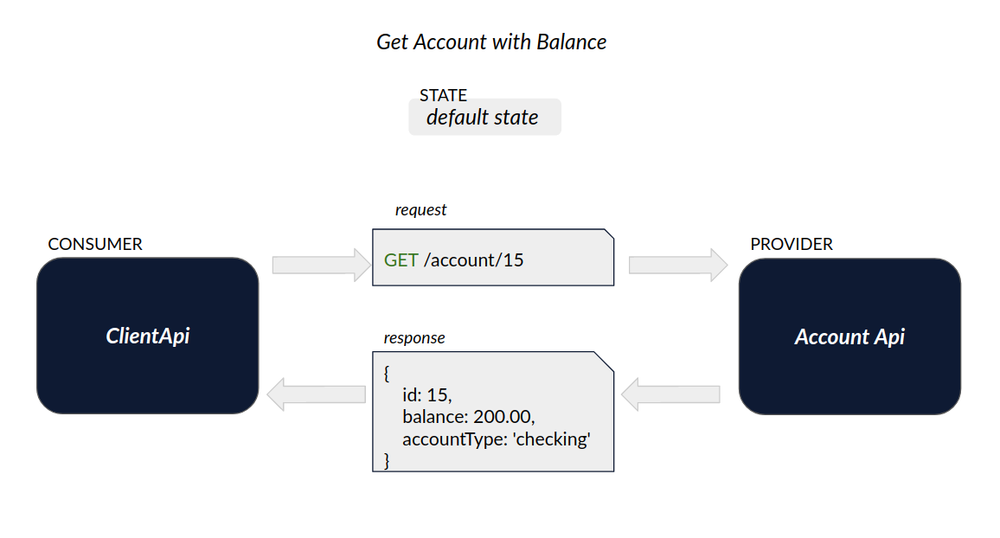

# Exemplo de uso do PACT em Node com OpenAPI Specification

Exemplo da criação de um Pact entre:

- 1 consumidor (account-api)
- 1 provedor (client-api)

## Ferramentas

- Node + npm
- Express
- [Typescript Rest](https://www.npmjs.com/package/typescript-rest)
- [Swagger Pact Validator](https://bitbucket.org/rcrodrigueszup/swagger-pact-validator)
- Pact
- Pact Broker
- Jest

## Índice

- [O que é OpenAPI Specification (OAS)?](#O-que-é-OpenApi-Specification-(OAS))
- [Cenários onde o teste de contrato baseado na OpenAPI Specification pode ser útil](#Cenários-onde-o-teste-de-contrato-baseado-na-OpenAPI-Specification-pode-ser-útil)
- [Usar contratos baseados na OpenAPI Specification requer cuidados!](#Usar-contratos-baseados-na-OpenAPI-Specification-requer-cuidados)
- [Cenário deste exemplo](#Cenário-deste-exemplo)
- [Integração com OpenAPI Specification](#Integração-com-OpenAPI-Specification)
- [Como executar](#Como-executar)

## O que é OpenAPI Specification (OAS)?

A especificação OpenAPI (OAS) define uma descrição de interface agnóstica de linguagem de programação padrão para APIs HTTP, que permite que humanos e computadores descubram e entendam os recursos de um serviço sem exigir acesso ao código-fonte, documentação adicional ou inspeção do tráfego de rede. Quando definido corretamente por meio do OpenAPI, um consumidor pode entender e interagir com o serviço remoto com uma quantidade mínima de lógica de implementação. Semelhante ao que as descrições de interface fizeram para a programação de nível inferior, a especificação OpenAPI remove as suposições ao chamar um serviço. 
Fonte: [The OpenAPI Specification](https://github.com/OAI/OpenAPI-Specification)

## Cenários onde o teste de contrato baseado na OpenAPI Specification pode ser útil

Quando um time decide adotar o Pact para garantir a integração entre consumidores e provedores ele deve, necessariamente:
1. Criar, no consumidor, a classe de testes do Pact que irá gerar as expectativas de consumo (contrato);
2. Criar, no provedor, a classe de testes do Pact que irá obter e validar o contrato em seus endpoints.

Mas, e quando a aplicação provedora não pode implementar o Pact? É neste ponto que entra a OpenAPI Specification. Imagine um cenário onde você está desenvolvendo um front-end que consumirá dados de uma API provedora de terceiros e que esse terceiro não irá implementar a classe de testes do Pact, uma possível solução é o provedor gerar um contrato JSON baseado na sua especificação OpenAPI e disponibilizar o arquivo para os consumidores realizarem as asserções baseadas no seu contrato. Em síntese, ficaria assim:



Agora basta o provedor disponibilizar o arquivo JSON gerado para que o consumidor realize as asserções conforme veremos adiante.

## Usar contratos baseados na OpenAPI Specification requer cuidados!

A utilização da OpenApi Specification para geração de contrato deve ser vista com cautela. Diferente da implementação do Pact no Consumer e Provider, onde em tempo de teste o contrato será verificado no endpoint real da aplicação provedora, quando utilizamos contrato baseado na especificação OpenApi há a real chance de falso positivo em cenários, como por exemplo, onde a documentação está desatualizada em relação ao estado atual do endpoint em ambiente de produção.
Mais informações em: [But I use Swagger/OpenAPI?](https://docs.pact.io/faq/convinceme/#but-i-use-swaggeropenapi)


## Cenário deste exemplo

Este exemplo aborda um cenário comum no setor bancário.
Nosso objetivo é obter o dado de saldo de determinado cliente. 
Para isto, vamos considerar que este dado será recuperado da seguinte forma:

1. Com o identificador do cliente, solicitamos ao serviço de dominio do cliente (client-api) o valor do saldo em conta.
2. Por sua vez, o client-api pergunta ao serviço de domínio da conta (account-api) qual o saldo contido na conta atrelada aquele cliente.
3. Tendo a informação do saldo em conta, o client-api retorna a informação a quem a solicitou.

De forma resumida, temos os seguintes serviços:

* account-api: mantém e gerencia informações relacionadas a contas bancárias.
* client-api: mantém e gerencia informações sobre clientes/correntistas.

A imagem abaixo representa esta interação que acabamos de definir.




## Integração com OpenAPI Specification

O contrato do cenário abordado neste exemplo é testado utilizando a biblioteca [Swagger Pact Validator](https://bitbucket.org/rcrodrigueszup/swagger-pact-validator). Esta biblioteca funciona da seguinte forma:

1. O consumidor gera seu contrato PACT como de costume e o publica no Pact Broker.
2. O provedor, por sua vez, gera sua documentação OpenAPI. Neste caso utilizamos o [Swagger V3+](https://swagger.io/specification/) que segue a especificação OpenAPI.
3. Utilizamos o cli do ```swagger-mock-validator``` para validar o contrato PACT junto à especificação OpenAPI do provedor. 

## Como executar

Aqui, temos o passo a passo para conseguirmos executar o cenário acima.

1. Garanta que você tenha uma instância do Pact Broker rodando localmente.
   Vide sessão [configuração do Pact Broker](../../../README.md#config-broker) caso tenha dúvida.

2. Com o Broker funcionando, podemos iniciar os testes.
   Primeiro, precisamos instalar as dependencias da API. Para isto, va até o diretório `consumer` e execute o seguinte comando:

```shell
npm install
```

Em seguida, precisamos gerar o contrato do PACT para a nossa API consumidora e o publicamos no Broker. <br>
No mesmo diretório, execute os seguintes comandos:

```shell
npm run test
```

```shell
npm run pact:publish
```

Acesse o Pact Broker (`http://localhost:9292`) em seu navegador. Você deverá ver o contrato publicado.


Caso tenha interesse, o contrato gerado pode ser conferido no diretório `consumer/pact`.

3. Para validar o contrato gerado, vamos até o diretório da nossa API provedora `provider`.
   Novamente, precisamos instalar as dependencias da API. Para isto, execute o seguinte comando:

```shell
npm install
```

Para testarmos o contrato com a API consumidora, precisamos apenas rodar o seguinte comando:

```shell
npm run pact:verify
```

Este teste irá verificar no Broker os contratos disponiveis para validação, baixá-los e testá-los de acordo com a especificação OpenAPI do Provedor.
Ao final, podemos conferir o resultado Broker:

