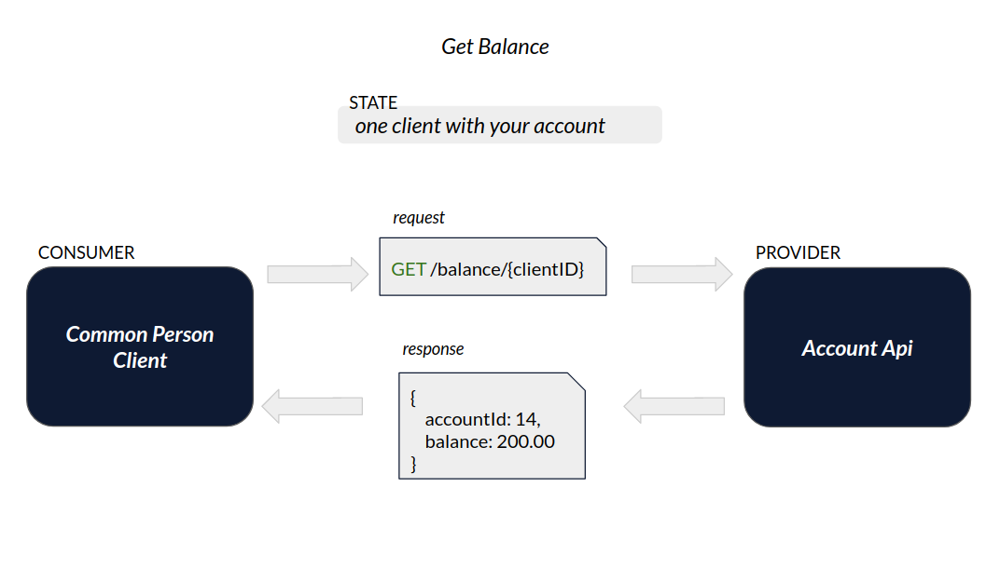
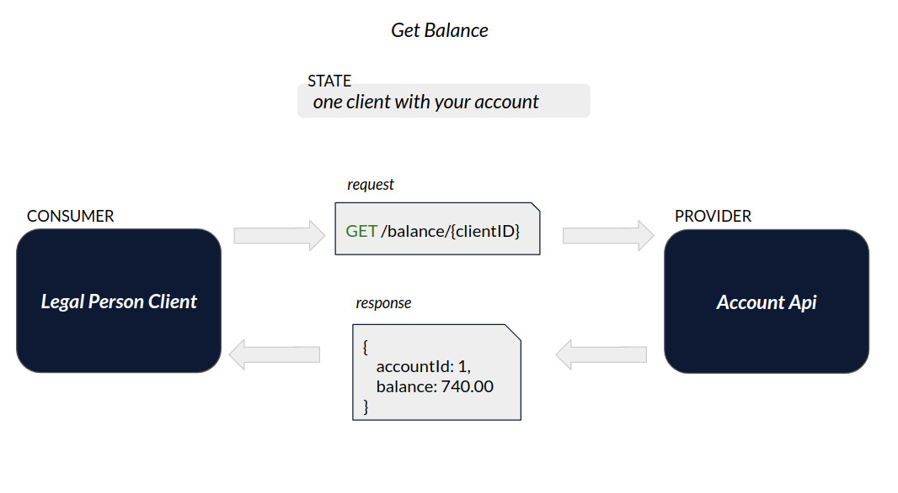

# Exemplo em Node

Exemplo da criação de um Pact entre:

- 2 consumidores (Consumers)
- 1 provedor (Provider)

* Veja este mesmo cenário feito em [Java](../../java/spring-boot/two_consumers_one_provider).

## Ferramentas

- Node + npm
- Express
- Typescript
- Jest
- Pact
- Pact Broker

## Índice

<!--ts-->

- [Cenários](#Cenários)
  - [Obtendo o saldo a partir do cliente pessoa física](#Obtendo-o-saldo-a-partir-do-cliente-pessoa-física)
  - [Obtendo o saldo a partir do cliente pessoa jurídica](#Obtendo-o-saldo-a-partir-do-cliente-pessoa-jurídica)
- [Como executar](#Como-executar)
<!--ts -->

## Cenários

Este exemplo aborda um cenário comum no setor bancário.
Nosso objetivo é obter o dado de saldo de determinado cliente e, neste caso, temos dois tipos de cliente, pessoa física e pessoa jurídica.
Para isto, vamos considerar que este dado será recuperado da seguinte forma:

### Obtendo o saldo a partir do cliente pessoa física

1 - Com o identificador do cliente, solicitamos ao serviço de dominio do cliente (common-person-client) o valor do saldo em conta. <br>
2 - Por sua vez, o common-person-client pergunta ao serviço de domínio da conta (account-api) qual o saldo contido na conta atrelada aquele cliente. <br>
3 - Tendo a informação do saldo em conta, o common-person-client retorna a informação a quem a solicitou.

A imagem abaixo representa esse fluxo.



### Obtendo o saldo a partir do cliente pessoa jurídica

1 - Com o identificador do cliente, solicitamos ao serviço de dominio do cliente (legal-person-client) o valor do saldo em conta. <br>
2 - Por sua vez, o legal-person-client-client pergunta ao serviço de domínio da conta (account-api) qual o saldo contido na conta atrelada aquele cliente. <br>
3 - Tendo a informação do saldo em conta, o common-person-client retorna a informação a quem a solicitou.

A imagem abaixo representa esse fluxo.



De forma resumida, temos os seguintes serviços:

- account-api: mantém e gerencia informações relacionadas a contas bancárias.
- legal-person-client: mantém e gerencia informações sobre clientes pessoa jurídica.
- common-person-client: mantém e gerencia informações sobre clientes pessoa física.

## Como executar

1. Garanta que você tenha uma instância do Pact Broker rodando localmente.
   Vide seção [configuração do Pact Broker](../../../README.md#config-broker) caso tenha dúvida.

2. Com o Broker funcionando, podemos iniciar os testes.
   Primeiro, precisamos instalar as dependencias da API. Para isto, va até o diretório `common-person-client` e execute o seguinte comando:

```shell
npm install
```

Em seguida, precisamos gerar o contrato do PACT para a nossa API consumidora e o publicamos no Broker. <br>
No mesmo diretório, execute os seguintes comandos:

```shell
npm run test
```

```shell
npm run pact:publish
```

Acesse o Pact Broker (`http://localhost:9292`) em seu navegador. Você deverá ver o contrato publicado.


Caso tenha interesse, o contrato gerado pode ser conferido no diretório `common-person-client/pacts`.

3. Para criar o contrato do segundo consumidor, siga o mesmo processo da etapa anterior no diretório
   `legal-person-clent`.

4. Para validar o contrato gerado, vamos até o diretório da nossa API provedora (provider) `account-api`.
   Novamente, precisamos instalar as dependencias da API. Para isto, execute o seguinte comando:

```shell
npm install
```

Para testarmos o contrato com a API consumidora, precisamos apenas rodar o teste da API.
Para isto, execute:

```shell
npm run test
```

Este teste irá verificar no Broker os contratos disponiveis para validação, baixá-los e testá-los de acordo com a API.
Ao final, podemos conferir o resultado do teste que é publicado no Broker.


